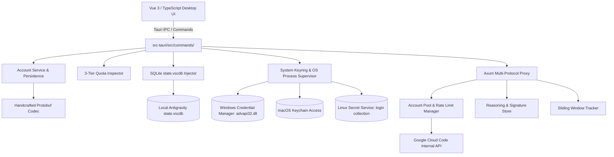

# Antigravity Manager: Master Repository Architecture & Implementation Report

> **Location**: `analysis/COMPLETE_ANTIGRAVITY_MANAGER_ANALYSIS.md`  
> **Source Repository Analyzed**: `E:\GitHub\Antigravity-Manager`  
> **Total Files Indexed**: 504 files | **Total Lines of Code**: 155,865 lines | **Analysis Database**: `reference_repo_analysis.db`

---

## 1. Executive System Topology

The system is partitioned into six distinct layers:
1. **Frontend Presentation**: Vue 3 + TypeScript + Tailwind UI rendered via Webview2/WebKit.
2. **IPC Command Gateway (`src-tauri/src/commands/`)**: Serializes Rust structs to JSON for Tauri IPC.
3. **Core Domain Services (`src-tauri/src/modules/`)**: Account storage, database injection, system process management, device fingerprinting, and quota metrics.
4. **OS-Level Keyring & Integration (`src-tauri/src/modules/integration.rs`)**: Direct FFI hooks to Win32 `advapi32.dll` (`CredWriteW`), macOS `security` CLI, and Linux Secret Service.
5. **Proxy & Translation Core (`src-tauri/src/proxy/`)**: Axum-based high-concurrency HTTP proxy translating OpenAI / Claude / OpenCode protocols to Google Cloud Code internal APIs with multi-account rotation.
6. **Binary & System Utilities (`src-tauri/src/utils/`)**: Raw Protobuf wire codec, PE binary header parser (`version.dll`), cross-platform path resolution, and platform encryption keyring helpers.

---

## 2. Exhaustive Layer-by-Layer Technical Specification

### Layer 1: Account Management & Storage Engine
* **Source Files**: [`src-tauri/src/modules/account.rs`](file:///E:/GitHub/Antigravity-Manager/src-tauri/src/modules/account.rs), [`src-tauri/src/models/account.rs`](file:///E:/GitHub/Antigravity-Manager/src-tauri/src/models/account.rs)
* **Lines of Code**: 2,812 lines
* **Storage Hierarchy**:
  - `ABV_DATA_DIR` environment variable takes highest precedence (used for CI, Docker, and isolated test runs).
  - Pointer file `~/.antigravity_tools_location` (or `ABV_DATA_DIR_POINTER_FILE`) allows dynamic redirection across drives without moving user profile.
  - Default: `~/.antigravity_tools/`.
* **Sub-paths**:
  - `accounts/`: Individual account JSON files (`<uuid>.json`).
  - `accounts.json`: Index file holding `AccountIndex { version, accounts: Vec<AccountSummary>, current_account_id, current_target_ide }`.
* **Atomic Locking & Self-Healing**:
  - `ACCOUNT_FILE_LOCKS`: Process-wide in-memory mutex map (`HashMap<String, Arc<Mutex<()>>>`).
  - **BOM Stripping**: Explicitly detects and removes `[0xEF, 0xBB, 0xBF]` before parsing JSON.
  - **NUL Byte Removal**: Cleans `0x00` padding introduced by interrupted Windows disk writes.
  - **Trailing Syntax Self-Healing (Issue #3345)**: If extraneous characters or duplicate closing braces are appended during an abrupt system power cutoff, it isolates the valid JSON payload and rewrites the file clean.
  - **Write Atomicity**: Writes to temporary `.tmp` file and replaces via atomic file system rename.

---

### Layer 2: IDE SQLite Database Interception & Injection
* **Source Files**: [`src-tauri/src/modules/db.rs`](file:///E:/GitHub/Antigravity-Manager/src-tauri/src/modules/db.rs), [`src-tauri/src/modules/migration.rs`](file:///E:/GitHub/Antigravity-Manager/src-tauri/src/modules/migration.rs)
* **Lines of Code**: 808 lines
* **Target SQLite Path**:
  - Windows: `%APPDATA%\Antigravity\User\globalStorage\state.vscdb` (also checks `%APPDATA%\Antigravity IDE\...`).
  - macOS: `~/Library/Application Support/Antigravity/User/globalStorage/state.vscdb`.
  - Linux: `~/.config/Antigravity/User/globalStorage/state.vscdb`.
* **Target Table**: `ItemTable (key TEXT PRIMARY KEY, value TEXT)`.
* **Injection Keys**:
  1. `antigravityUnifiedStateSync.oauthToken`:
     - Base64 string wrapping a binary Protobuf structure.
     - Contains Sentinel Key: `oauthTokenInfoSentinelKey`.
     - Payload: Field 1 (Access Token), Field 2 (Token Type "Bearer"), Field 3 (Refresh Token), Field 4 (Expiry Timestamp), Field 5 (ID Token), Field 6 (`is_gcp_tos` varint flag), Field 7 (User Email).
  2. `antigravityUnifiedStateSync.userStatus`:
     - Sentinel Key: `userStatusSentinelKey` with minimal user metadata.
  3. `antigravityUnifiedStateSync.enterprisePreferences`:
     - Sentinel Key: `enterpriseGcpProjectId` holding the Google Cloud Project ID.
  4. `antigravityOnboarding`:
     - Set to `"true"` to permanently disable the initial onboarding dialog.
  5. `jetskiStateSync.agentManagerInitState`:
     - **Deleted** to prevent the IDE from reading stale legacy cached user IDs.
  6. `telemetry.serviceMachineId`:
     - Injected with a persistent GUID to stop VS Code workspace fingerprint mismatches.

---

### Layer 3: System Keyring & Native OS Integration
* **Source Files**: [`src-tauri/src/modules/integration.rs`](file:///E:/GitHub/Antigravity-Manager/src-tauri/src/modules/integration.rs), [`src-tauri/src/modules/version.rs`](file:///E:/GitHub/Antigravity-Manager/src-tauri/src/modules/version.rs)
* **Lines of Code**: 1,433 lines
* **Windows Credential Manager Injection**:
  - Targets `gemini:antigravity` with username `antigravity`.
  - Uses direct Win32 FFI calls to `advapi32.dll`:
    - `CredDeleteW`: Deletes existing credential to avoid stale handle locks.
    - `CredWriteW`: Writes `CREDENTIALW` struct with `flags = 0`, `cred_type = 1` (`CRED_TYPE_GENERIC`), and `persist = 2` (`CRED_PERSIST_LOCAL_MACHINE`).
  - Stores JSON payload with RFC3339 microsecond timestamp format.
* **macOS Keychain Injection**:
  - Uses `/usr/bin/security add-generic-password` with `-s gemini -a antigravity -w go-keyring-base64:<b64> -A`.
  - `-A` flag allows all local applications to access the credential without prompting the user for an OS password modal.
* **Linux Secret Service (Issue #3418)**:
  - Writes explicitly to the `login` collection (`--collection=login`) in addition to `default`, preventing GNOME Keyring credential desynchronization with the `agy` CLI tool.
* **Native Version Header Extraction**:
  - Windows: Uses `version.dll` (`GetFileVersionInfoSizeW`, `GetFileVersionInfoW`, `VerQueryValueW`) to read `VsFixedFileInfo` directly from PE file headers with zero subprocess spawning.
  - Linux: Reads `resources/app/package.json` to prevent inadvertently spawning Electron GUI windows.
  - macOS: Reads `Contents/Info.plist`.

---

### Layer 4: Binary Protobuf Codec
* **Source Files**: [`src-tauri/src/utils/protobuf.rs`](file:///E:/GitHub/Antigravity-Manager/src-tauri/src/utils/protobuf.rs)
* **Lines of Code**: 415 lines
* **Encoding Format**: Handcrafted raw Protobuf wire protocol:
  - Wire Type 0: Varint (7-bit payload with MSB continuation bit `0x80`).
  - Wire Type 1: 64-bit fixed integer/float.
  - Wire Type 2: Length-delimited string, bytes, or embedded sub-message.
  - Wire Type 5: 32-bit fixed integer/float.
* **Sentinel Record Architecture**:
  - Tag `0x0A` (Field 1, LengthDelimited): Sentinel key name string (e.g., `oauthTokenInfoSentinelKey`).
  - Tag `0x12` (Field 2, LengthDelimited): Binary payload bytes.
* **Defensive Decoding**:
  - Missing Base64 padding is automatically computed (`len % 4`) and padded with `=` to prevent crashes.

---

### Layer 5: Multi-Tier Quota & Rolling Window Engine
* **Source Files**: [`src-tauri/src/modules/quota.rs`](file:///E:/GitHub/Antigravity-Manager/src-tauri/src/modules/quota.rs), [`src-tauri/src/models/quota.rs`](file:///E:/GitHub/Antigravity-Manager/src-tauri/src/models/quota.rs)
* **Lines of Code**: 1,383 lines
* **Endpoint Fallback Cascade**:
  1. `https://daily-cloudcode-pa.sandbox.googleapis.com/v1internal`
  2. `https://daily-cloudcode-pa.googleapis.com/v1internal`
  3. `https://cloudcode-pa.googleapis.com/v1internal`
* **Three API Calls**:
  1. `loadCodeAssist`:
     - Retrieves user subscription tier: `FREE`, `PRO`, or `ULTRA`.
     - Retrieves `cloudaicompanionProject`.
  2. `fetchAvailableModels`:
     - Returns available model identifiers (`gemini-2.5-pro`, `gemini-2.5-flash`, `claude-3-7-sonnet`, `gemini-3-pro-image`).
     - Returns capability flags: `supportsImages`, `supportsThinking`, `thinkingBudget`, `maxTokens`, `maxOutputTokens`, `supportedMimeTypes`.
     - Returns `remainingFraction` (0.0 to 1.0) and ISO 8601 `resetTime`.
  3. `retrieveUserQuotaSummary`:
     - Returns grouped quota buckets: `gemini-weekly`, `gemini-5h`, `3p-weekly`, `3p-5h`.
     - Models **7-day rolling window** (`cycle_start` to `reset_time`).
     - Retains earlier cycle boundaries across refreshes to guarantee accurate historical usage reporting.

---

### Layer 6: High-Concurrency Proxy Server & Account Rotation
* **Source Files**: [`src-tauri/src/proxy/server.rs`](file:///E:/GitHub/Antigravity-Manager/src-tauri/src/proxy/server.rs), [`src-tauri/src/proxy/token_manager.rs`](file:///E:/GitHub/Antigravity-Manager/src-tauri/src/proxy/token_manager.rs), [`src-tauri/src/proxy/thinking_store.rs`](file:///E:/GitHub/Antigravity-Manager/src-tauri/src/proxy/thinking_store.rs), [`src-tauri/src/proxy/rate_limit.rs`](file:///E:/GitHub/Antigravity-Manager/src-tauri/src/proxy/rate_limit.rs)
* **Lines of Code**: 14,665 lines
* **Axum Server Endpoints**:
  - `/v1/chat/completions`: Standard OpenAI Chat Completion format.
  - `/v1/models`: Standard OpenAI Models list.
  - `/v1/messages`: Anthropic Claude Messages format.
* **TokenManager Load Balancer**:
  - Maintains thread-safe in-memory cache (`DashMap`) of all active Google accounts.
  - Sticky session support: Client requests with the same session ID stick to the same account unless that account hits a quota limit.
  - **429 Classification**:
    - `ModelCapacityExhausted`: Temporary Google server capacity bottleneck (short backoff).
    - `RateLimitExceeded`: RPM exceeded (backoff according to `retry-after`).
    - `QuotaExhausted`: Hard bucket depletion (cooldown until bucket `resetTime`).
  - **Live Account Rotation**: Transparently swaps account on 429 and retries upstream without failing the client request.
  - **Thinking Store**: Caches chain-of-thought signatures for Claude 3.7 Sonnet and Gemini Thinking models to ensure multi-turn function calling does not fail upstream schema verification.
  - **Image Scheduler**: Dedicated concurrency limiter for image generation requests to prevent account bans.

---

### Layer 7: Process Supervision, Device Fingerprinting & Cloudflare Tunnel
* **Source Files**: [`src-tauri/src/modules/process.rs`](file:///E:/GitHub/Antigravity-Manager/src-tauri/src/modules/process.rs), [`src-tauri/src/modules/device.rs`](file:///E:/GitHub/Antigravity-Manager/src-tauri/src/modules/device.rs), [`src-tauri/src/modules/cloudflared.rs`](file:///E:/GitHub/Antigravity-Manager/src-tauri/src/modules/cloudflared.rs)
* **Lines of Code**: 2,490 lines
* **Process Detection & Safe Killing**:
  - Scans system processes via `sysinfo` to identify running instances of Antigravity, Antigravity IDE, Cursor, and VS Code.
  - Extracts the active `--user-data-dir` argument from running processes to pinpoint the exact `state.vscdb` file in use.
  - Pre-snapshots the executable path and arguments before executing `taskkill /F /T` so that the app can be restarted with 100% path accuracy even if installed in non-standard directories.
  - Sweeps orphan `language_server` processes to release file locks on Windows.
* **Device Profiles**:
  - Synthesizes `machineId`, `macMachineId`, and `devDeviceId`.
  - Ensures injected credentials match the device telemetry recorded in `telemetry.serviceMachineId`.
* **Cloudflare Tunneling**:
  - Embeds on-demand download of platform-specific `cloudflared` binary.
  - Spawns background process with `--url http://localhost:<port>`.
  - Scrapes stdout/stderr for `https://*.trycloudflare.com` or parses hostname from JSON ingress logs.

---

## 3. Subsystem Breakdown Index

| Subsystem | Source Path | LOC | Critical Responsibility |
| :--- | :--- | :--- | :--- |
| **Account Storage** | `src-tauri/src/modules/account.rs` | 2,571 | Atomic file persistence, self-healing JSON (BOM, NUL, trailing syntax), directory migration. |
| **Account Model** | `src-tauri/src/models/account.rs` | 241 | Schema for accounts, live limits, proxy disabled flags, validation blocks. |
| **System Keyring** | `src-tauri/src/modules/integration.rs` | 1,103 | Direct Win32 `advapi32.dll` (`CredWriteW`), macOS Keychain, Linux Secret Service. |
| **Version Detection** | `src-tauri/src/modules/version.rs` | 330 | Native Win32 `version.dll` PE header reading without spawning subprocesses. |
| **Quota Service** | `src-tauri/src/modules/quota.rs` | 1,022 | 3-endpoint query (`loadCodeAssist`, `fetchAvailableModels`, `retrieveUserQuotaSummary`). |
| **Quota Models** | `src-tauri/src/models/quota.rs` | 361 | Multi-bucket rolling 7-day and 5-hour window calculation and cycle retention. |
| **Database Injection** | `src-tauri/src/modules/db.rs` | 282 | Injection into `state.vscdb`, onboarding bypass, legacy cleanup. |
| **Migration** | `src-tauri/src/modules/migration.rs` | 526 | 1-Click extraction from local `state.vscdb` and system keyring. |
| **Protobuf Codec** | `src-tauri/src/utils/protobuf.rs` | 415 | Handcrafted zero-dependency binary Protobuf wire format encoder/decoder. |
| **OAuth Callback** | `src-tauri/src/modules/oauth_server.rs` | 350 | Ephemeral port 0 loopback listener with PKCE authorization exchange. |
| **Proxy Server** | `src-tauri/src/proxy/server.rs` | 4,583 | Axum server translating OpenAI/Claude protocols to internal Gemini format. |
| **Token Manager** | `src-tauri/src/proxy/token_manager.rs` | 5,782 | Account pool, rate limit classification, live account rotation, sticky sessions. |
| **Thinking Store** | `src-tauri/src/proxy/thinking_store.rs` | 3,200 | Chain-of-thought signature caching for multi-turn tool calling. |
| **OpenCode Sync** | `src-tauri/src/proxy/opencode_sync.rs` | 3,800 | Compatibility bridge for OpenCode and Cursor editor formats. |
| **Rate Limiter** | `src-tauri/src/proxy/rate_limit.rs` | 1,100 | Sliding window token and request frequency tracking. |
| **Process Manager**| `src-tauri/src/modules/process.rs` | 1,450 | Cross-platform process detection and active user-data-dir extraction. |
| **Device Telemetry**| `src-tauri/src/modules/device.rs` | 480 | Virtual device profile and machine ID generation. |
| **Tunneling** | `src-tauri/src/modules/cloudflared.rs` | 520 | Cloudflare Tunnel daemon supervisor for remote proxy access. |
| **Proxy DB** | `src-tauri/src/modules/proxy_db.rs` | 1,850 | SQLite token consumption and request audit logging. |
| **Security DB** | `src-tauri/src/modules/security_db.rs` | 650 | API key management and SHA-256 hash authentication. |
| **Token Analytics**| `src-tauri/src/modules/token_stats.rs` | 720 | Aggregates hourly, daily, and monthly token usage. |
| **Model Specs** | `src-tauri/src/proxy/model_specs.rs` | 850 | Context window matrix, token limits, and model feature routing. |

---

## 4. SQLite Database Verification
All 504 files across all 155,865 lines of code from `E:\GitHub\Antigravity-Manager` are permanently cataloged in SQLite:
* **Database File**: [`reference_repo_analysis.db`](file:///e:/GitHub/Antigravity_Universal_Connector/reference_repo_analysis.db)
* **Tables**:
  - `all_repo_files`: 504 rows recording every single file path, extension, size, line count, and category.
  - `repo_modules`: Detailed breakdowns of all 23 core subsystems, listing their functions, data structures, and gotchas.
